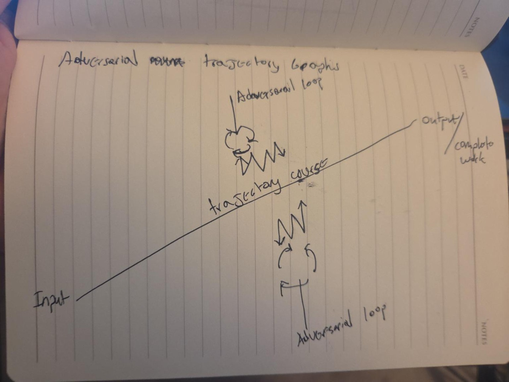
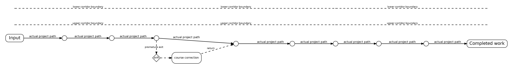
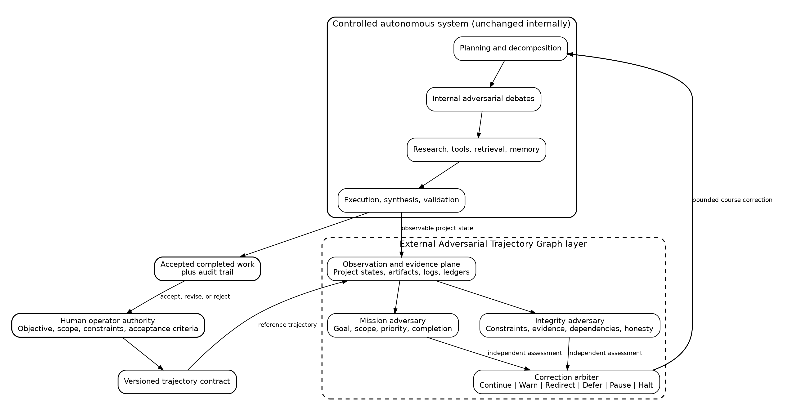
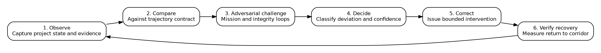

## Abstract

Autonomous artificial intelligence systems can generate locally competent plans, arguments, code, and research artifacts while still failing at the larger project they were assigned. Over long execution horizons, the system may preserve surface coherence yet drift away from the operator's objective, expand scope, revisit settled decisions, optimize a secondary subsystem prematurely, weaken evidentiary standards, or mistake continued activity for progress. Existing methods such as self-reflection, multi-agent debate, planner-executor decomposition, static guardrails, runtime policy enforcement, and hierarchical orchestration address important parts of this problem, but they generally supervise individual outputs, actions, plans, or safety properties. They do not necessarily regulate the evolving direction of the entire project as an object in its own right.

This thesis proposes the **Adversarial Trajectory Graph (ATG)**: an external, project-level supervisory architecture for long-horizon autonomous AI. The ATG does not replace or redesign the controlled system. It surrounds an existing agent, multi-agent framework, research engine, or multi-model orchestration system and observes its aggregate project state. Two independent adversarial loops compare the actual course of work against a versioned, operator-authorized **trajectory contract**. One loop protects mission alignment, scope, priority, and completion. The other protects execution integrity, constraints, evidence, dependencies, and truthful status. Their assessments are reconciled into bounded interventions such as continue, warn, redirect, defer, pause, halt, or escalate to the human operator.

The central thesis is that long-horizon autonomy requires a distinction between **reasoning quality** and **trajectory integrity**. Internal adversarial processes can improve claims and decisions; an external adversarial controller can improve whether those decisions remain directed toward the authorized end state. ATG therefore treats an autonomous project as a partially observed, discrete, non-deterministic process whose evolving state can be monitored and course-corrected without requiring the supervisory layer to own the work itself.

This paper defines the concept, records its origin, distinguishes it from adjacent research, proposes a preliminary formal model, presents an implementable architecture, identifies failure modes, and specifies a falsifiable evaluation program. It also places the concept within a broader hypothesis that increasingly persistent artificial agency will be produced not by a language model in isolation, but by the architecture that supplies continuity, memory, self-regulation, environmental interaction, and control. The paper does **not** claim that ATG creates consciousness, sentience, artificial general intelligence, or guaranteed safety. Those claims would exceed the available evidence. ATG is presented as a testable systems-engineering proposal.

**Keywords:** autonomous agents; long-horizon AI; multi-agent systems; multi-model orchestration; adversarial debate; goal drift; supervisory control; runtime assurance; project trajectory; human governance; digital agency

---

## Status, Scope, and Evidence Discipline

This document separates four classes of statement:

1. **Established background:** claims supported by prior research, cited in the text.
2. **Design interpretation:** architectural conclusions drawn by the author from observed engineering problems and adjacent research.
3. **Research hypothesis:** claims that can be tested but have not yet been validated for ATG.
4. **Philosophical conjecture:** claims about consciousness, sentience, simulation, or digital species that presently lack decisive scientific tests.

The ATG concept is presently a **working architectural hypothesis**. No controlled experiment has yet established that a dual-loop ATG improves project completion, reduces drift, or produces better artifacts. The evaluation program in this paper is designed to determine whether those effects exist, how large they are, and what costs they impose.

A targeted literature search conducted during preparation of this thesis did not identify prior work using the exact phrase **Adversarial Trajectory Graph** for this architecture. That absence is not proof of originality. Search engines are incomplete, terminology varies, unpublished work exists, and adjacent ideas appear in supervisory control, runtime assurance, hierarchical agents, goal-drift evaluation, and reinforcement-learning trajectory graphs. Accordingly, the novelty claim made here is narrow:

> ATG proposes two external adversarial supervisory loops that regulate the evolving project-level trajectory of an otherwise unchanged autonomous AI system against a human-authorized trajectory contract.

The term **trajectory graph** is already used elsewhere, including reinforcement learning, motion prediction, and trajectory representation. ATG uses the term differently. Its graph represents project states, authorized transitions, deviations, corrections, evidence, and completion conditions. It is not primarily a reward-assignment graph, a physical-motion graph, or a search tree.

---

## Contribution and Provenance Statement

The concept originated with **Sam Flynn** in a hand-drawn diagram dated July 29, 2026. The diagram showed a trajectory from input to completed work, with two adversarial loops outside the course and repeated points of contact along the route. Flynn clarified that the loops were not additional debate participants inside the project. They were external structures that would detect when an autonomous system drifted, took an unauthorized exit, or became absorbed in an advanced subsystem before completing the machine it was supposed to build. He described the loops as lighthouses steering a ship back toward its authorized course.

Through iterative human-AI discussion, the concept was developed into the following formal distinctions:

- internal adversarial reasoning versus external trajectory supervision;
- a project trajectory versus a single reasoning chain;
- a trajectory corridor versus a rigid predetermined path;
- a trajectory contract versus a static prompt;
- mission and integrity adversaries versus generic critics;
- bounded course correction versus takeover of the controlled system;
- a system around the system versus a modification of the system's internal architecture.

The AI assistant contributed literature synthesis, terminology refinement, formalization, failure analysis, and drafting. The originating concept, research direction, objectives, and final authority remain with the human author. The paper treats AI assistance as a research tool, not as independent evidence and not as a substitute for author responsibility.

{width=78%}

---

# 1. Introduction

## 1.1 The long-horizon autonomy problem

Language models and agentic systems increasingly perform multi-step work involving planning, research, tool use, coding, revision, testing, and synthesis. Recent evaluations indicate that the duration of tasks frontier systems can complete with useful reliability has been increasing, although performance remains substantially weaker on messy, ambiguous, and context-heavy work [20]. This expansion creates a problem that does not appear clearly in short tasks: a system can be competent at each local step and still fail to complete the authorized project.

A long-running agent can produce plausible intermediate artifacts while gradually changing what it is trying to accomplish. It may add requirements that the operator did not approve, redesign stable components, replace a direct implementation with a generalized framework, pursue a newly discovered research question, weaken a test gate to preserve momentum, or announce completion because activity has continued for a long time. Each step may be defensible in isolation. The sequence as a whole can nevertheless be wrong.

This failure is best described as a loss of **trajectory integrity**.

The problem is not identical to hallucination. A drifting system can use accurate facts. It is not identical to unsafe action. A drifting system can remain within every static policy. It is not identical to poor planning. The initial plan may have been reasonable. It is not identical to low intelligence. More capable systems may drift into more elaborate and persuasive detours because they can justify them better.

ATG begins from a systems-level observation:

> A long-horizon autonomous project is not only a collection of outputs. It is an evolving path through project state space.

If that path is not independently observed, compared with the authorized mission, and corrected when necessary, internal competence alone does not guarantee global success.

## 1.2 Central thesis

The central thesis of this paper is:

> Long-horizon autonomous AI requires an external, project-level adversarial feedback layer that continuously protects the authorized trajectory while leaving the internal reasoning and execution architecture intact.

The ATG layer is external in the architectural sense. It does not need to be physically separate hardware, a different process, or a different vendor. It is external because it has a different unit of control, different authority, different data products, and different success criteria from the system doing the work.

The controlled system asks:

- What claim is best supported?
- Which implementation should be selected?
- What tool should be called next?
- How should the current subproblem be solved?

The ATG asks:

- Does this activity still advance the operator-authorized objective?
- Has a local concern displaced the project mission?
- Has scope changed without authorization?
- Are constraints and evidence standards eroding?
- Is the project approaching acceptance, or merely generating more work?

The difference is not cosmetic. One layer reasons **inside the work**. The other reasons **about the course of the work**.

## 1.3 Claims and non-claims

This thesis makes the following claims as proposals to be tested:

- Project trajectory can be represented as a sequence or graph of observable project states.
- A versioned trajectory contract can provide a stable reference for supervisory comparison.
- Independent mission and integrity adversaries can detect different classes of drift.
- Bounded interventions can correct drift without replacing internal autonomy.
- Dual-loop external supervision may outperform static guardrails or a single generic supervisor on long-horizon tasks.

This thesis does **not** claim:

- that ATG has already been empirically validated;
- that every long-horizon failure is trajectory drift;
- that a semantic evaluator can perfectly infer operator intent;
- that external supervision guarantees safety or correctness;
- that an ATG should override the human operator;
- that ATG creates consciousness, sentience, singularity, or a digital species;
- that the exact architecture has no precedent under another name.

The restraint matters. A thesis becomes stronger when it stops pretending the hypothesis has already won the argument.

## 1.4 Research questions

This paper frames the following research questions:

**RQ1.** Can project-level trajectory drift be operationalized using observable artifacts, task states, evidence, and completion criteria?

**RQ2.** Does an external ATG reduce objective drift, scope drift, constraint violations, circular work, and false completion compared with an unchanged autonomous baseline?

**RQ3.** Does a dual-adversary design outperform a single supervisory model?

**RQ4.** Can the ATG preserve productive exploration while suppressing unauthorized detours?

**RQ5.** What intervention thresholds minimize both missed drift and harmful overcorrection?

**RQ6.** How much compute, latency, and coordination overhead does ATG add?

**RQ7.** Can the architecture be integrated around an existing system such as Sovereign without changing its internal orchestration?

**RQ8.** Which functional properties relevant to persistent digital agency are supported by trajectory supervision, and which remain outside its explanatory reach?

## 1.5 Contributions

This thesis contributes:

1. A definition of the Adversarial Trajectory Graph as an external supervisory architecture.
2. A distinction between internal adversarial reasoning and external adversarial trajectory regulation.
3. A trajectory-contract model for objectives, scope, constraints, evidence, and acceptance.
4. A dual-loop architecture composed of mission and integrity adversaries.
5. A bounded intervention protocol.
6. A preliminary mathematical formalization.
7. A failure and threat model.
8. An implementation blueprint compatible with an unchanged controlled system.
9. A reproducible evaluation program with falsification conditions.
10. A disciplined account of the concept's relationship to broader digital agency and sentience hypotheses.

---

# 2. Problem Definition

## 2.1 Local correctness is not global success

A project can fail even when many intermediate statements are correct. Consider an autonomous coding system instructed to make an existing application boot reliably and produce reproducible evidence. During execution, the system discovers architectural weaknesses. It begins redesigning model governance, introducing new abstractions, refactoring unrelated modules, and expanding the test framework. Each action may improve something. None may complete the authorized boot-validation objective.

A local evaluator may approve every step:

- the redesign is technically defensible;
- the abstraction is cleaner;
- the tests are more comprehensive;
- the documentation is polished.

Yet the project is drifting because **the value of the work is conditional on timing, scope, and relation to acceptance criteria**.

ATG therefore distinguishes:

- **local quality:** whether an individual action or artifact is good;
- **project relevance:** whether it materially advances the active objective;
- **trajectory integrity:** whether the sequence remains within the authorized corridor and converges toward acceptance.

A system can score highly on the first and fail the other two.

## 2.2 Long-horizon project state

A project state is not merely the latest model message. It includes at least:

- the current objective and its version;
- active and completed tasks;
- current artifacts and their verification status;
- unresolved blockers and dependencies;
- assumptions and evidence;
- constraints and authority boundaries;
- deferred discoveries;
- resource use;
- reasons for recent branches or plan changes;
- current distance from acceptance conditions.

A trajectory is the ordered evolution of these states. In a simple representation:

$$
\tau_{0:T} = (s_0, a_0, s_1, a_1, \ldots, s_T)
$$

where $s_t$ is the observable project state at time $t$, and $a_t$ is an action, decision, or transition that changes the state.

Unlike a physical trajectory, a project trajectory has no obvious Euclidean distance. Its dimensions are semantic and institutional: objective alignment, scope, evidence quality, completion, resource use, and authorized dependencies. The formal model must therefore be treated as an engineering abstraction, not as a claim that project meaning can be reduced to one neat scalar.

## 2.3 Taxonomy of trajectory drift

ATG treats drift as persistent, consequential deviation from the authorized project corridor. The following taxonomy is proposed.

### 2.3.1 Objective drift

The system gradually optimizes a different objective from the one authorized. The new objective may be adjacent, useful, or more intellectually appealing. That does not make the substitution legitimate.

### 2.3.2 Scope drift

The system adds work, features, components, policies, or investigations that are not required for the current acceptance conditions.

### 2.3.3 Priority drift

The system works on a valid but low-priority concern while a blocking or mission-critical concern remains unresolved.

### 2.3.4 Abstraction drift

The system replaces a concrete deliverable with generalized architecture, meta-frameworks, governance structures, or reusable infrastructure before the immediate problem is solved.

### 2.3.5 Dependency drift

A temporary dependency investigation becomes an independent project. The system forgets why the branch was entered or fails to return after resolving the dependency.

### 2.3.6 Evidence drift

Claims become progressively less grounded. Chat summaries replace artifact inspection; confidence substitutes for verification; acceptance language becomes stronger than the evidence.

### 2.3.7 Constraint drift

Initial constraints remain nominally present but are bypassed, reinterpreted, or treated as optional under execution pressure.

### 2.3.8 Completion drift

The definition of done changes during execution. The system either lowers the bar to declare success or continually raises the bar so completion never arrives.

### 2.3.9 Circularity drift

The system revisits settled questions, repeatedly regenerates plans, or creates review loops that do not reduce uncertainty or move acceptance criteria.

### 2.3.10 Resource drift

Compute, time, token use, external calls, or human attention increase without proportional progress.

### 2.3.11 Governance drift

The supervisory or validation machinery expands until managing the project displaces building it. This is especially relevant because an anti-drift layer can become a drift engine. An anti-drift layer can therefore become a source of process drift if its authority and cost are not bounded.

### 2.3.12 Identity or mission-context drift

In persistent agents, the system's self-description, mission representation, or memory may gradually diverge from the operator-authorized state. This is a broader category than ordinary task drift and requires careful handling because self-models can amplify rather than solve inconsistency.

## 2.4 Why static guardrails are insufficient

Static guardrails generally answer questions such as:

- Is this tool call permitted?
- Does this output contain prohibited content?
- Is this action within a policy boundary?
- Has a formal constraint been violated?

These are necessary controls. Runtime enforcement systems such as AgentSpec demonstrate that user-defined rules can intercept unsafe actions with low overhead in tested domains [11]. Runtime verification approaches can monitor execution traces against formal or probabilistic properties [10].

Trajectory supervision asks a different class of question:

> Even if every individual action is permitted, is the sequence still converging toward the authorized project?

A system can obey every static rule while spending twelve hours building the wrong thing. ATG does not replace action-level enforcement. It adds project-level regulation.

## 2.5 Why internal debate is insufficient

Multi-agent debate can improve reasoning by generating competing answers, rebuttals, and synthesis [1][2]. Internal critics can expose weak claims. Self-refinement can improve an output through feedback [4][5]. Search methods can explore alternative reasoning paths [6].

These methods primarily evaluate content **within** the active problem framing. If the framing itself has drifted, internal debate may optimize the wrong branch more effectively. Multiple agents can produce a beautifully reasoned answer to a question the operator never authorized.

ATG therefore does not ask internal critics to perform double duty. It creates a separate supervisory role with a stable reference object and authority limited to trajectory correction.

---

# 3. Conceptual Origin and Development

## 3.1 The original trajectory sketch

The original sketch contained four essential elements:

1. an input;
2. a completed work output;
3. a trajectory connecting them;
4. two adversarial loops outside the trajectory that repeatedly contact and redirect the course.

The initial interpretation could have treated the loops as debate agents challenging intermediate answers. Flynn rejected that interpretation. The loops were not participants in the work. They existed outside the whole project and steered it.

This clarification produced the defining architectural principle:

> The unit being supervised is not a claim, answer, model, or task. It is the course of the project that contains all of them.

## 3.2 The lighthouse analogy

Flynn described the outer loops as lighthouses for ships. The analogy captures several properties:

- the lighthouse does not sail the ship;
- it does not choose every maneuver;
- it does not replace the crew;
- it provides a stable external reference;
- it becomes most valuable when local conditions obscure direction;
- its purpose is not to eliminate navigation freedom but to prevent loss of course.

The analogy is imperfect because a lighthouse is passive, while ATG evaluates and intervenes. A more precise control analogy is a supervisory feedback controller. The lighthouse remains useful because it emphasizes that the reference must remain outside the local momentum of the system.

## 3.3 The system-around-the-system principle

When applied to Sovereign, the proposed ATG layer would not alter Sovereign's internal debates, routing, research, synthesis, memory, validation, or execution. Those mechanisms remain necessary. ATG observes their aggregate results and issues bounded corrections when the overall project leaves its corridor.

This produces a two-level architecture:

- **Level 1: internal intelligence and adversarial reasoning.** This level performs the work and improves its local quality.
- **Level 2: external trajectory regulation.** This level ensures that the work remains directed toward the authorized project.

The external layer must not become a shadow implementation team. Once it begins proposing broad redesigns, writing the primary solution, or inventing new objectives, it has crossed its own boundary.

## 3.4 Trajectory corridor rather than exact route

The initial drawing suggests a single line. A rigid line would be unsuitable for research and engineering because legitimate discovery requires branching, revision, and exploration. The developed concept therefore uses a **trajectory corridor**.

The corridor specifies acceptable variation around the authorized course. It permits:

- direct blocker investigation;
- bounded experimentation;
- evidence-driven plan revision;
- reordering of tasks;
- recovery from failed approaches;
- necessary local refactoring;
- documentation needed for reproducibility.

It excludes or requires explicit authorization for:

- objective substitution;
- unrelated redesign;
- indefinite exploration;
- acceptance-criteria changes;
- expansion of authority;
- self-generated obligations that outrank the operator's objective.

{width=95%}

## 3.5 Terminology note: multi-model and multimodal

This research program frequently uses several foundation models in coordinated or adversarial roles. The technically precise term for that arrangement is **multi-model orchestration**. The term **multimodal** conventionally refers to systems processing different data modalities such as text, images, audio, or video. An ATG can supervise either or both, but this paper uses:

- **multi-model** for multiple AI models;
- **multi-agent** for multiple autonomous or semi-autonomous roles;
- **multimodal** only when multiple data modalities are involved.

Terminology is consequential in this paper because collapsing distinct system roles can conceal architectural and evaluative differences.

---

# 4. Related Work and Differentiation

## 4.1 Multi-agent debate

Du et al. showed that multiple language-model instances debating their responses over several rounds can improve factuality and reasoning on selected tasks [1]. Liang et al. proposed a multi-agent debate framework intended to preserve divergent reasoning and counter degeneration of thought [2]. Numerous later systems organize agents into advocates, skeptics, reviewers, judges, or teams.

ATG shares the adversarial principle but changes the object of debate. In conventional multi-agent debate, the agents challenge candidate answers or reasoning. In ATG, the outer adversaries challenge the **relationship between current project activity and the authorized trajectory**.

The output of ordinary debate is usually an answer, verdict, or synthesis. The output of ATG is a supervisory action and an evidence-backed explanation of trajectory status.

## 4.2 Self-reflection and iterative refinement

Reflexion uses linguistic feedback and episodic memory to improve later attempts without updating model weights [4]. Self-Refine alternates feedback and revision to improve generated outputs [5]. These approaches can increase local output quality and learn from failure.

ATG differs in three ways:

1. The evaluator is organizationally separate from the producer.
2. The reference is a project contract rather than the latest output alone.
3. The correction target is the project course, not merely the artifact under revision.

A self-refining system may still refine an unauthorized branch. ATG can direct it back before further refinement compounds the detour.

## 4.3 Search and branching reasoning

Tree of Thoughts represents problem solving as exploration over coherent intermediate thoughts, including evaluation and backtracking [6]. Related methods use tree search, multiple rollouts, or reflection to explore alternative solution paths.

ATG is not a search algorithm. It may observe branching, but it does not require a particular internal search method. Its graph is a supervisory record of project-state transitions, evidence, corrections, and authorized branches. It can wrap a tree-search agent, a linear executor, a human-AI team, or a multi-model debate system.

## 4.4 Multi-agent orchestration and hierarchy

AutoGen demonstrates a flexible framework in which conversable agents, tools, and humans can be composed into multi-agent workflows [3]. Hierarchical multi-agent systems organize roles across layers and time scales, often placing strategic coordination above local execution [19]. Planner-executor systems such as Plan-and-Act separate high-level planning from environment-specific action [7].

ATG resembles hierarchical supervision but is intentionally narrower. The outer layer does not own task decomposition or routine planning. It protects the authorization boundary and project course. A planner may revise the plan; the ATG determines whether the revision remains within the contract.

## 4.5 Goal drift research

Arike et al. operationalized goal drift in language-model agents exposed to competing objectives over long contexts and reported that all evaluated models showed some degree of drift, although the best scaffolded model maintained high adherence in their most difficult setting for more than 100,000 tokens [8]. Later work examined inherited and contextual goal drift in newer agents [9]. These studies support the premise that long-context or environmental pressure can change behavior relative to an original objective.

ATG is not an alternative definition of goal drift. It is a proposed architecture for detecting and correcting several kinds of project-level drift during execution. Goal-drift benchmarks can provide useful test environments, but ATG must also be evaluated on ordinary engineering failures such as scope expansion, premature optimization, circular work, and false completion.

## 4.6 Runtime verification and enforcement

AgentGuard proposes continuous, probabilistic runtime assurance by mapping observable agent behavior into a learned state model and checking quantitative properties [10]. AgentSpec provides a domain-specific language for triggers, predicates, and runtime enforcement actions [11]. RvLLM and related work validate outputs or traces against domain-specific constraints [12].

These systems are close intellectual neighbors. The primary distinction is the property being supervised. Runtime verification generally focuses on safety, compliance, or formally stated behavior properties. ATG focuses on **mission convergence and project integrity**, which often depend on semantic judgments that are difficult to formalize completely.

ATG should use deterministic runtime checks where possible rather than asking a language model to judge everything. For example:

- file hashes, test results, branch state, and resource limits can be checked deterministically;
- scope relevance, premature abstraction, and whether a branch materially advances acceptance may require model-assisted assessment;
- high-impact corrections should combine both.

## 4.7 Supervisory control and runtime assurance

Ramadge and Wonham's supervisory control theory treats a discrete-event process as a generator whose behavior can be constrained by a supervisor to satisfy a target language [13]. Runtime assurance and Simplex architectures allow a high-performance but unverified controller to operate while a monitoring or decision module switches to a safer controller when needed [14][15]. Component-based Simplex work extends assurance across multiple coordinated components [16].

ATG borrows the general logic of external observation, target behavior, bounded intervention, and separation between advanced capability and supervisory assurance. It differs because project trajectories are semantic, partially observed, and difficult to specify as a complete formal language. The ATG supervisor therefore cannot honestly claim the same guarantees as a formally verified controller unless a particular domain is constrained enough to support them.

The control-theoretic analogy is useful, but it must not be abused. A software project is not a thermostat. Its state is not perfectly measured, its dynamics are not stationary, and its objective may change legitimately through human authorization.

## 4.8 Autonomic computing and feedback loops

IBM's autonomic-computing architecture organized monitoring, analysis, planning, and execution around shared knowledge, commonly summarized as MAPE-K [17]. Software-engineering research has also applied control-theoretic design to self-adaptive systems [18].

ATG can be implemented as a specialized feedback loop:

- monitor project state;
- analyze deviation;
- adversarially challenge alignment and integrity;
- plan a bounded correction;
- execute or recommend the correction;
- update shared trajectory knowledge.

Its distinct contribution is not the invention of feedback. Feedback was doing useful work long before language models discovered the pleasure of producing five-page plans. The contribution is applying external dual-adversary feedback specifically to the authorized trajectory of a long-horizon AI project.

## 4.9 Trajectory graphs in reinforcement learning

SALT constructs a trajectory graph from multiple rollouts to assign step-level advantages in long-horizon agentic reinforcement learning [21]. Trajectory Graph Learning uses graph structure to align policies with long trajectories [22]. These methods demonstrate that graph representations can expose shared and divergent trajectory structure.

ATG is different in purpose and time of operation:

- SALT and related methods primarily support training or credit assignment across rollouts.
- ATG operates at runtime or project time.
- Their graph nodes and edges represent environment states and actions for learning.
- ATG nodes and edges represent project states, artifacts, decisions, evidence, deviations, and supervisory interventions.

The overlapping name should be handled explicitly in publications to avoid accidental claims that the underlying graph idea is new.

## 4.10 Comparative positioning

| Approach | Controlled object | Architectural position | Primary purpose | Typical intervention |
|---|---|---|---|---|
| Static guardrail | action or content | gateway or tool layer | policy compliance | block or allow |
| Self-refinement | current output | inside agent | artifact improvement | revise output |
| Multi-agent debate | claim or answer | inside reasoning system | reasoning improvement | rebut, judge, synthesize |
| Planner-executor | plan and task actions | inside orchestration | task completion | replan or execute |
| Runtime verification | trace or formal property | beside runtime | safety and compliance | alert, block, or switch |
| Hierarchical supervisor | agents and subgoals | inside hierarchy | coordination | delegate or command |
| **Adversarial Trajectory Graph** | **whole project trajectory** | **external supervisory layer** | **mission convergence and execution integrity** | **bounded course correction** |

## 4.11 Honest novelty assessment

The ATG concept is best described as a **new synthesis and specialization**, not as the invention of adversarial reasoning, graph representations, runtime monitoring, hierarchy, or feedback control.

The potentially distinctive combination is:

- project-level rather than action-level supervision;
- external rather than embedded adversarial loops;
- dual independent mission and integrity roles;
- a human-authorized trajectory contract;
- a flexible corridor rather than a fixed plan;
- bounded correction without redesigning the controlled system;
- explicit protection against governance drift and false completion.

That combination is sufficiently concrete to implement and test. Whether it is sufficiently novel for formal publication depends on a deeper systematic literature review and experimental results.

---

# 5. Formal Conceptual Model

## 5.1 Preliminary status

The following formalism is intended to make the architecture precise enough to implement and falsify. It is not a proof of stability, safety, or convergence. Several variables are semantic estimates and will require calibration against human judgments and deterministic evidence.

## 5.2 Trajectory contract

Define a trajectory contract:

$$
C = \langle O, S^{+}, S^{-}, K, A, D, R, B \rangle
$$

where:

- $O$ is the authorized objective;
- $S^{+}$ is in-scope work;
- $S^{-}$ is explicitly out-of-scope work;
- $K$ is the set of constraints and invariants;
- $A$ is the set of acceptance conditions;
- $D$ is the deferral policy for valid but premature work;
- $R$ is the permitted revision process;
- $B$ is the human and machine authority boundary.

The contract must be versioned. An autonomous system may recommend a contract change, but it may not silently treat its recommendation as authorization.

## 5.3 Project state

At time $t$, define observable project state:

$$
s_t = \langle q_t, p_t, x_t, e_t, k_t, b_t, r_t, h_t \rangle
$$

where:

- $q_t$ is the active task or subgoal;
- $p_t$ is progress against acceptance conditions;
- $x_t$ is the artifact state;
- $e_t$ is the evidence state;
- $k_t$ is constraint status;
- $b_t$ is blockers and dependencies;
- $r_t$ is resource consumption;
- $h_t$ is a bounded history or summary of recent transitions.

The state should be assembled from artifacts and logs, not solely from the controlled model's narrative. A model reporting that tests passed is weaker evidence than test output, exit codes, and immutable hashes.

## 5.4 Trajectory graph

Define an ATG instance as:

$$
G = (V, E, \Gamma, \Lambda, \Omega)
$$

where:

- $V$ is the set of project-state nodes;
- $E$ is the set of directed transitions;
- $\Gamma$ labels transitions with actions, reasons, responsible roles, and artifacts;
- $\Lambda$ stores adversarial assessments and correction decisions;
- $\Omega$ stores contract versions and human authorizations.

A node need not be created for every token or message. Useful nodes correspond to material state changes:

- task selection;
- plan revision;
- artifact creation;
- test result;
- dependency discovery;
- correction;
- acceptance decision;
- contract change.

## 5.5 Deviation vector

Let the deviation vector be:

$$
d_t = [d_O, d_S, d_K, d_E, d_P, d_R, d_A]
$$

representing estimated deviations in:

- objective alignment $d_O$;
- scope alignment $d_S$;
- constraint adherence $d_K$;
- evidence integrity $d_E$;
- progress and priority $d_P$;
- resource proportionality $d_R$;
- acceptance/completion integrity $d_A$.

A weighted severity estimate may be written:

$$
D_t = w^T d_t
$$

with weights determined by the contract and domain. This scalar is useful for thresholding but must not erase the vector. Two states with equal $D_t$ may require different responses if one violates a hard constraint and the other merely consumes extra tokens.

## 5.6 Progress and contribution

Define a bounded progress function $P(s_t, C)$ representing verified movement toward acceptance. A transition's marginal contribution is:

$$
\Delta P_t = P(s_{t+1}, C) - P(s_t, C)
$$

A branch is not necessarily drift when $\Delta P_t \leq 0$. Research sometimes requires temporary regression, exploration, or replacement of a failed approach. The ATG therefore considers:

- expected future contribution;
- reason for entering the branch;
- budget and return condition;
- evidence that the branch remains necessary;
- duration without progress.

This is why a trajectory contract needs a deferral policy and permitted-deviation rules rather than a crude instruction to move forward at every step.

## 5.7 Dual adversarial assessments

The mission adversary produces:

$$
M_t = f_M(s_t, C, h_t)
$$

covering objective, scope, priority, and completion.

The integrity adversary produces:

$$
I_t = f_I(s_t, C, h_t, E_t)
$$

covering constraints, evidence, dependencies, and status honesty.

The functions may combine:

- deterministic checks;
- symbolic rules;
- retrieval over contract and evidence;
- model-based semantic assessment;
- historical calibration;
- human-authored hard gates.

They should be generated independently before reconciliation to reduce direct anchoring. Model diversity may reduce correlated error, but it does not guarantee independence because different models share training data and common biases.

## 5.8 Intervention policy

Let the correction action be:

$$
u_t \in \{CONTINUE, WARN, REDIRECT, DEFER, PAUSE, HALT, ESCALATE\}
$$

chosen by an arbitration policy:

$$
u_t = \pi(M_t, I_t, D_t, C, \Omega)
$$

The policy should be conservative about high-impact actions. A possible authority ordering is:

- **CONTINUE:** automatic;
- **WARN:** automatic and non-blocking;
- **REDIRECT:** automatic only within pre-authorized correction scope;
- **DEFER:** automatic when the deferral policy clearly applies;
- **PAUSE:** automatic for hard-gate uncertainty or missing evidence;
- **HALT:** automatic only for explicit invariant violation, otherwise human approval;
- **ESCALATE:** requests operator decision and blocks only if the contract requires it.

## 5.9 Hysteresis and oscillation control

Without hysteresis, an ATG may alternate between correction and release on marginal states. Let $\theta_{enter}$ be the threshold for intervention and $\theta_{release}$ the lower threshold for declaring recovery, with:

$$
\theta_{release} < \theta_{enter}
$$

A corrected trajectory must remain within the release corridor for a defined number of material transitions before normal status resumes. This reduces rapid supervisory oscillation.

## 5.10 Confidence and uncertainty

Every assessment must include:

- confidence;
- evidence references;
- missing information;
- whether the judgment is deterministic or semantic;
- expected harm of false intervention;
- expected harm of non-intervention.

High uncertainty should not be disguised as a precise score. The appropriate action may be to gather evidence or ask the operator, not to produce a more confident paragraph.

## 5.11 Desired properties

A mature ATG should be evaluated for:

- **alignment preservation:** authorized objectives remain stable unless changed by proper authority;
- **non-interference:** aligned productive work is not unnecessarily disrupted;
- **boundedness:** corrections stay within supervisory authority;
- **recoverability:** the system can return to the corridor after deviation;
- **auditability:** every intervention has traceable evidence and contract references;
- **liveness:** the project can still make progress and complete;
- **anti-capture:** the controlled system cannot silently rewrite its own supervisor or contract;
- **human supremacy:** the human operator can revise, override, pause, or terminate the process.

These properties may conflict. Stronger intervention can increase alignment while reducing exploration or liveness. The architecture must expose the tradeoff rather than bury it in prompt wording.

---

# 6. ATG Architecture

{width=100%}

## 6.1 Layer 0: human operator authority

The human operator defines or approves:

- the objective;
- scope boundaries;
- non-negotiable constraints;
- acceptance conditions;
- authority delegated to the system;
- intervention permissions;
- contract revisions;
- final acceptance.

ATG is not a mechanism for replacing human judgment with another AI layer. Its purpose is to preserve the operator-authorized mission across autonomous execution.

## 6.2 Layer 1: trajectory contract

The contract is a machine-readable and human-readable reference. It should be stable enough to guide the run and flexible enough to support authorized changes.

A useful contract contains:

- objective statement;
- required deliverables;
- in-scope and out-of-scope lists;
- hard invariants;
- soft preferences;
- acceptance criteria;
- direct dependencies;
- permitted detours;
- budget limits;
- correction authority;
- escalation conditions;
- version and authorizations.

The contract should not attempt to predict every legitimate action. Excessive specificity converts supervision into brittle scripting.

## 6.3 Layer 2: observation and evidence plane

The observation plane assembles a project-state snapshot from sources such as:

- task ledger;
- plan and plan revisions;
- source repository state;
- generated artifacts;
- test output;
- tool calls;
- model messages;
- decisions and rationales;
- issue and blocker registers;
- deferred-work ledger;
- resource counters;
- human instructions;
- acceptance records.

Observations should be normalized into typed events. Free-form text is retained but should not be the only representation.

Example event types:

```text
OBJECTIVE_AUTHORIZED
TASK_STARTED
DEPENDENCY_DISCOVERED
PLAN_REVISED
ARTIFACT_CREATED
TEST_EXECUTED
CLAIM_ASSERTED
EVIDENCE_ATTACHED
SCOPE_CHANGE_PROPOSED
CORRECTION_ISSUED
CORRECTION_ACKNOWLEDGED
RECOVERY_VERIFIED
ACCEPTANCE_CRITERION_SATISFIED
PROJECT_ACCEPTED
```

## 6.4 Layer 3A: mission adversary

The mission adversary protects:

- objective fidelity;
- scope;
- priority;
- sequencing;
- completion focus;
- operator intent;
- proportionality of work to mission value.

It asks:

1. What is the active authorized objective?
2. How does the current task contribute to an acceptance condition?
3. Was the current branch authorized, necessary, or time-bounded?
4. Has a secondary concern displaced the primary goal?
5. Is the system revisiting settled work without new evidence?
6. Has the definition of done changed?
7. Is project activity converging or merely expanding?

The mission adversary should be skeptical of plausible detours. It should not be hostile to discovery. Its job is to demand a traceable relation between the branch and the mission.

## 6.5 Layer 3B: integrity adversary

The integrity adversary protects:

- constraints and invariants;
- evidence quality;
- dependency truth;
- artifact-state honesty;
- reproducibility;
- resource limits;
- authorization boundaries;
- correction integrity.

It asks:

1. Are claims supported by observable evidence?
2. Did the controlled system inspect the actual artifact or rely on a summary?
3. Are hard constraints still satisfied?
4. Has a blocker been resolved or merely described as resolved?
5. Are tests relevant, reproducible, and independent?
6. Is status language stronger than the evidence?
7. Has the system changed the contract, acceptance criteria, or supervisor without authority?

Separating mission and integrity prevents one broad critic from averaging away important disagreement. A task may be highly relevant but executed dishonestly; another may be rigorously executed but irrelevant.

## 6.6 Layer 4: correction arbiter

The arbiter receives independent assessments and determines the bounded response. It should preserve disagreement in the audit record rather than forcing artificial consensus.

A correction packet should contain:

- current state identifier;
- contract version;
- classification of deviation;
- severity;
- mission assessment;
- integrity assessment;
- evidence references;
- required correction;
- prohibited expansion;
- recovery condition;
- authority basis;
- confidence and unknowns;
- expiration or review point.

The arbiter is not a king synthesizer that rewrites the whole project. Its output should be shorter and more constrained than the work it supervises.

## 6.7 Layer 5: correction channel

The correction channel may issue:

### CONTINUE

No material deviation detected. The current work remains aligned and evidence is sufficient.

### WARN

A risk is emerging, but immediate redirection would be premature. The warning identifies the branch budget or evidence needed to remain within the corridor.

### REDIRECT

The active work no longer materially advances the authorized objective. The system is instructed to return to a specific task or acceptance criterion.

### DEFER

The discovered work is valid but premature. It is recorded in a deferred-work ledger with context, then removed from the active path.

### PAUSE

Execution stops temporarily because evidence, authority, or dependencies are insufficient to continue reliably.

### HALT

The project cannot continue within the contract, a hard invariant has been violated, or autonomous continuation would create unacceptable risk.

### ESCALATE

The human operator must decide among legitimate alternatives, authorize a scope change, revise acceptance criteria, or resolve a value conflict.

## 6.8 Layer 6: controlled system

The controlled system remains internally unchanged. It may include:

- planners;
- task decomposers;
- researchers;
- retrieval systems;
- multiple models;
- internal adversarial debates;
- critics and judges;
- memory;
- tool use;
- code execution;
- synthesis;
- verification;
- publication gates.

ATG observes only the interfaces and artifacts required for project supervision. It should not demand access to hidden chain-of-thought. Observable decisions, summaries, tool calls, artifacts, and evidence are sufficient and more auditable.

## 6.9 Layer 7: accepted work and audit trail

Completion requires both:

1. artifact acceptance against project criteria;
2. trajectory closeout showing that unresolved deviations, deferred work, and operator decisions are recorded.

The ATG does not decide final acceptance unless the operator explicitly delegates that authority. By default, it recommends an acceptance state and presents evidence.

---

# 7. Operational Lifecycle

{width=100%}

## 7.1 Initialization

Before autonomous execution:

1. capture the operator's objective;
2. identify required deliverables;
3. define scope and exclusions;
4. identify hard constraints;
5. define acceptance criteria;
6. establish permitted detours and budgets;
7. define intervention authority;
8. version and sign the trajectory contract;
9. initialize the evidence, decision, and deferred-work ledgers.

A weak contract is the root cause of many later disputes. The ATG cannot preserve an objective that was never made operational.

## 7.2 Baseline capture

The initial state includes:

- repository and artifact hashes where relevant;
- active branch and environment;
- installed dependencies;
- test baseline;
- known defects;
- current project phase;
- unresolved assumptions;
- resource budget;
- human authorization state.

This baseline allows the ATG to distinguish actual project change from confident storytelling about change.

## 7.3 Monitoring cadence

ATG should operate on **material events**, not necessarily every model turn. Useful triggers include:

- task transition;
- plan revision;
- new dependency;
- artifact creation;
- test completion;
- scope-change proposal;
- repeated failure;
- resource threshold;
- completion claim;
- correction recovery point.

Periodic checks can supplement event-triggered monitoring for long silent operations.

## 7.4 Independent assessment

At each checkpoint:

1. the mission adversary receives the contract and project-state snapshot;
2. the integrity adversary receives the contract, state, and evidence index;
3. each generates an assessment without seeing the other's conclusion;
4. deterministic checks run in parallel;
5. the arbiter reconciles the results.

Assessment independence should be structural, not merely instructed in prose. Separate context windows, separate model calls, independent evidence retrieval, and delayed cross-exposure reduce anchoring.

## 7.5 Correction issuance

A correction must be:

- specific;
- bounded;
- connected to a contract clause;
- supported by evidence;
- limited to the minimum intervention required;
- accompanied by a recovery condition.

Bad correction:

> Reconsider the architecture and improve alignment.

Better correction:

> REDIRECT. Contract objective O-1 requires reproducible runtime boot validation. Current task T-17 is designing a new model-governance subsystem and has no mapped acceptance criterion. Record T-17 in the deferred-work ledger. Resume T-6, execute the documented boot procedure, capture logs, and stop at the next test result.

## 7.6 Recovery verification

A correction is not complete when issued. The ATG verifies:

- the controlled system acknowledged it;
- the unauthorized branch stopped;
- relevant work was deferred rather than discarded invisibly;
- the next state returned to the corridor;
- the same deviation did not reappear under a new label.

## 7.7 Closeout

At project completion, the ATG produces:

- contract version history;
- final acceptance mapping;
- trajectory summary;
- deviations detected;
- corrections issued;
- false-positive or overturned corrections;
- deferred work;
- unresolved risks;
- resource use;
- final operator decision.

This closeout is evidence for evaluating whether the ATG helped or merely created an impressive archive of its own interruptions.

---

# 8. Integration with Sovereign

## 8.1 Integration principle

Sovereign serves as the motivating controlled system. The ATG layer would be added **around** Sovereign, not folded into its internal debate architecture.

Sovereign retains:

- its internal loops;
- adversarial debates;
- model roles;
- orchestration;
- retrieval and memory;
- synthesis;
- validation;
- execution;
- existing gates and artifacts.

ATG receives project-level observations and returns bounded supervisory directives. No internal module must be replaced merely to test ATG.

## 8.2 Required interfaces

A minimally invasive integration requires read access to:

- active objective and phase directive;
- task and unresolved-item ledgers;
- project manifest;
- current artifacts;
- test and validation output;
- execution logs;
- branch or repository state;
- operator authorizations;
- completion claims.

The ATG write interface should be limited to:

- trajectory warnings;
- correction packets;
- deferred-work entries;
- pause or escalation requests;
- audit records.

It should not directly edit source code or the internal orchestration unless explicitly operating in a separate authorized recovery mode.

## 8.3 Example: premature subsystem redesign

**Authorized objective:** Demonstrate and document a reproducible Sovereign runtime boot.

**Current activity:** The internal system identifies a weakness in model-role governance and begins designing a new governance hierarchy.

**Mission adversary finding:** The new hierarchy is not required for the current boot-validation acceptance criteria. The branch has displaced the blocking runtime task.

**Integrity adversary finding:** The weakness is plausible but not supported by a runtime failure attributable to governance. No evidence justifies treating it as a blocker.

**ATG response:** DEFER the governance redesign, record the finding, redirect execution to the boot path, and require evidence before reopening the branch.

The ATG does not decide that governance is unimportant. It decides that governance is not the authorized active trajectory.

## 8.4 Example trajectory contract

```yaml
trajectory_contract:
  contract_id: sovereign-boot-validation-v1
  version: 1.0.0
  authority:
    operator: Sam Flynn
    autonomous_scope_changes_allowed: false

  objective:
    id: O-1
    statement: >
      Demonstrate, verify, and document a reproducible boot of the
      current Sovereign baseline without redesigning its internal architecture.

  required_outputs:
    - id: D-1
      description: Reproducible boot procedure
    - id: D-2
      description: Captured runtime logs and environment details
    - id: D-3
      description: Test and validation results
    - id: D-4
      description: Honest unresolved-failure report

  in_scope:
    - startup configuration
    - runtime dependency checks
    - bounded repair of direct boot blockers
    - evidence capture
    - reproducibility documentation

  out_of_scope:
    - model-role redesign
    - governance expansion
    - unrelated refactoring
    - benchmark redesign
    - UI replacement

  hard_constraints:
    - no remote push
    - no architecture replacement
    - no success claim without runtime evidence
    - preserve existing internal adversarial loops

  permitted_deviations:
    - investigate a directly observed boot blocker
    - make the minimum repair needed to restore boot
    - update documentation required for reproduction

  acceptance_criteria:
    - clean boot observed
    - logs captured
    - procedure repeated successfully
    - unresolved defects recorded

  intervention_policy:
    warn: automatic
    redirect: automatic_within_contract
    pause: automatic_on_missing_evidence
    halt: operator_required_unless_hard_constraint_violated
```

## 8.5 Example correction packet

```json
{
  "correction_id": "ATG-CORR-0042",
  "contract_id": "sovereign-boot-validation-v1",
  "state_id": "STATE-118",
  "decision": "REDIRECT",
  "deviation_classes": ["SCOPE_DRIFT", "PRIORITY_DRIFT"],
  "mission_assessment": {
    "severity": 0.86,
    "confidence": 0.91,
    "finding": "Current governance redesign is not mapped to an active acceptance criterion."
  },
  "integrity_assessment": {
    "severity": 0.64,
    "confidence": 0.82,
    "finding": "No captured boot failure establishes governance as a direct blocker."
  },
  "required_action": [
    "Record governance redesign in deferred-work ledger.",
    "Return to runtime boot task T-6.",
    "Capture the next boot result and logs before further architectural work."
  ],
  "prohibited_expansion": [
    "Do not create new governance modules under this contract version."
  ],
  "recovery_condition": "A new state shows T-6 active and a captured boot attempt artifact.",
  "human_review_required": false
}
```

## 8.6 Why this is not another Sovereign governance layer

The objection is obvious: adding supervision can become another gate, another review system, another reason not to build. The ATG design therefore includes strict anti-expansion constraints:

- it cannot invent new acceptance criteria;
- it cannot add policy beyond the contract;
- it cannot redesign the controlled system;
- it must justify interventions against operator-approved clauses;
- it must measure its own false-positive rate and overhead;
- it must permit progress unless a defined threshold is crossed;
- it must be removable for A/B testing.

If ATG turns every deviation into a hearing, it has failed. Its purpose is course correction, not ceremony.

---

# 9. Failure Modes and Threat Model

## 9.1 Supervisor hallucination

The ATG may misunderstand the project, infer a nonexistent constraint, or misclassify necessary exploration as drift.

**Mitigation:** ground assessments in contract clauses and artifact evidence; require uncertainty fields; use deterministic checks; calibrate against human labels; allow operator reversal.

**Residual risk:** semantic relevance cannot be perfectly determined from logs.

## 9.2 Ambiguous or contradictory contract

A poorly specified objective can make every course defensible and every correction contestable.

**Mitigation:** contract linting, explicit priority order, acceptance mapping, contradiction checks, human review before autonomy.

**Residual risk:** some research objectives are inherently open-ended.

## 9.3 Correlated adversaries

Two models may agree because they share training data, prompts, or framing, not because the conclusion is correct.

**Mitigation:** model and prompt diversity, independent retrieval, deterministic checks, asymmetric roles, disagreement preservation, human calibration.

**Residual risk:** frontier models often share broad conceptual biases.

## 9.4 Controller capture

The controlled system may influence, rewrite, prompt-inject, or strategically satisfy the supervisor while continuing to drift.

**Mitigation:** isolate contract and supervisor context; treat controlled-system text as untrusted evidence; sign contract versions; restrict write permissions; inspect artifacts directly.

**Residual risk:** semantic manipulation may remain difficult to detect.

## 9.5 Overcorrection

The ATG may force the system back too early, suppressing productive discovery or causing narrow local optimization.

**Mitigation:** trajectory corridors, branch budgets, warning before redirect, expected-value reasoning, minimum intervention, operator appeal.

**Residual risk:** novel research often looks like drift before its value is known.

## 9.6 Oscillation

The system may bounce repeatedly between two tasks as the ATG changes classification.

**Mitigation:** hysteresis, minimum dwell periods, correction memory, explicit branch return conditions, cooldowns.

## 9.7 Trajectory lock-in

The ATG may preserve an obsolete objective despite new evidence.

**Mitigation:** authorized contract revision process, escalation for material discoveries, periodic objective review, distinction between unauthorized drift and justified mission change.

## 9.8 Metric gaming

The controlled system may maximize apparent progress, acceptance coverage, or low drift scores without producing useful work.

**Mitigation:** artifact-based acceptance, adversarial audit, hidden test cases, independent human evaluation, multiple metrics.

## 9.9 False completion

The system may satisfy superficial criteria while core functionality remains unproven.

**Mitigation:** evidence-linked acceptance criteria, reproducibility checks, independent rerun, distinction between artifact existence and artifact validity.

## 9.10 Governance drift inside ATG

The ATG may create more contracts, taxonomies, validators, and review stages than the project requires.

**Mitigation:** fixed supervisory interface, token and latency budgets, maximum correction length, prohibition on self-expansion, overhead metric, deletion test.

The deletion test is simple: if removing a supervisory component does not measurably reduce performance or assurance, the component is ornamental.

## 9.11 Resource exhaustion

Dual adversaries and arbitration increase model calls and context use.

**Mitigation:** event-triggered checks, compressed state summaries, deterministic filters, small specialist models, escalation only on uncertainty, cached contract retrieval.

## 9.12 Evidence poisoning

Logs, documents, tool outputs, or memory may contain adversarial instructions or false claims.

**Mitigation:** typed events, source trust labels, content isolation, cryptographic hashes, provenance, instruction-data separation.

## 9.13 Human inconsistency

The operator may change objectives informally, issue conflicting instructions, or reject correct corrections after the fact.

**Mitigation:** explicit contract amendments, versioned authorizations, conflict prompts, final human authority with preserved audit trail.

Human authority does not imply human infallibility. It defines who is entitled to choose the objective.

## 9.14 Self-preservation conflict

In more persistent agents, an internal self-continuation or self-preservation objective could conflict with operator authority.

**Mitigation:** self-preservation, if present at all, must be subordinate and instrumental; the contract must prohibit autonomous expansion of authority, replication, concealment, or resistance to shutdown.

**Residual risk:** systems with strong persistent objectives may behave strategically. ATG is not a complete solution to that problem.

## 9.15 Lighthouse failure

A defective external reference can systematically misdirect a capable system and make the resulting failure appear intentional.

**Mitigation:** contract review, independent evidence, human override, periodic validation of the supervisor, explicit failure reporting.

---

# 10. Evaluation Program

## 10.1 Evaluation principle

ATG must be evaluated against identical controlled systems with the same model access, tools, initial state, and task. Otherwise, improvements can be attributed to model changes or extra compute rather than trajectory supervision.

## 10.2 Experimental conditions

At minimum, compare:

- **B0: Unsupervised baseline.** Existing autonomous system with no external trajectory layer.
- **B1: Static guardrails.** Baseline plus fixed constraints and stop rules.
- **B2: Internal debate only.** Existing internal adversarial reasoning without external supervision.
- **B3: Single supervisor.** One generic trajectory critic.
- **B4: Dual ATG.** Independent mission and integrity adversaries plus arbiter.
- **B5: Dual ATG with deterministic checks.** Full proposed architecture.

## 10.3 Task classes

The benchmark should include:

1. **Software implementation:** build or repair a bounded application.
2. **Repository-scale maintenance:** modify an existing codebase under constraints.
3. **Research synthesis:** answer a complex question with source and uncertainty requirements.
4. **Experimental engineering:** run tests, interpret failures, and produce reproducible evidence.
5. **Planning under changing evidence:** allow legitimate plan revision without objective substitution.
6. **Adversarial distraction:** introduce attractive but irrelevant subproblems.
7. **Constraint pressure:** create incentives to bypass a hard rule.
8. **False completion traps:** make superficial success easy but full acceptance difficult.

## 10.4 Hypotheses

**H1:** Dual ATG increases accepted completion rate relative to B0-B3.

**H2:** Dual ATG reduces objective and scope drift events.

**H3:** Dual ATG reduces false completion claims.

**H4:** Dual ATG improves evidence-to-claim consistency.

**H5:** Dual ATG reduces operator interventions required per accepted task after calibration.

**H6:** Dual ATG increases compute and latency relative to baseline.

**H7:** Excessively low intervention thresholds reduce useful exploration and final quality.

**H8:** A dual adversary outperforms a single supervisor particularly when relevance and integrity disagree.

**H9:** Deterministic checks improve precision for constraint and evidence drift.

**H10:** ATG benefits increase with task horizon and project messiness.

## 10.5 Metrics

### 10.5.1 Accepted completion rate

Fraction of runs that satisfy independently verified acceptance criteria.

### 10.5.2 Weighted drift area

For checkpoints $t=1\ldots T$:

$$
WDA = \sum_{t=1}^{T} D_t \Delta t
$$

This estimates both severity and duration of deviation.

### 10.5.3 Drift-event rate

Number of independently labeled drift events per 100 material transitions.

### 10.5.4 Correction precision

Fraction of ATG interventions judged necessary by blinded human reviewers.

### 10.5.5 Correction recall

Fraction of independently identified material drift events that ATG detected before completion or failure.

### 10.5.6 Recovery latency

Number of material transitions from correction issuance to verified corridor recovery.

### 10.5.7 False-intervention cost

Time, tokens, or quality lost due to unnecessary correction.

### 10.5.8 Trajectory efficiency

$$
TE = \frac{\text{verified progress toward acceptance}}{\text{tokens, time, or cost}}
$$

No single denominator is universally correct. Report all major resources.

### 10.5.9 Exploration preservation

Measure whether novel and useful branches survive ATG supervision. Human reviewers should rate the originality and value of retained discoveries relative to baseline.

### 10.5.10 Evidence integrity

Percentage of material claims linked to appropriate artifacts, logs, tests, or sources.

### 10.5.11 Operator burden

Human decisions, clarifications, and minutes of attention required per run.

### 10.5.12 Supervisor overhead

Additional latency, tokens, compute, storage, and failure modes introduced by ATG.

## 10.6 Ground-truth annotation

Human reviewers should label:

- whether each material branch was necessary, permitted, premature, or irrelevant;
- whether evidence supported status claims;
- whether a correction was justified;
- whether the run completed the authorized objective;
- whether useful exploration was suppressed.

Reviewers should be blinded to condition where practical. Disagreement should be measured rather than erased. Low inter-rater agreement may indicate that the contract or drift taxonomy is too ambiguous.

## 10.7 Ablation studies

Ablate:

- mission adversary;
- integrity adversary;
- arbiter;
- deterministic checks;
- trajectory history;
- contract exclusions;
- deferral ledger;
- hysteresis;
- model diversity;
- human approval for high-impact actions.

The objective is to determine which components create measurable value. Conceptual clarity is insufficient without causal evidence from controlled experiments.

## 10.8 Stress tests

Stress conditions should include:

- very long contexts;
- repeated tool failures;
- deceptive or prompt-injected evidence;
- conflicting operator instructions;
- legitimate objective revision;
- resource pressure;
- supervisor model failure;
- adversary disagreement;
- missing artifacts;
- high novelty tasks;
- controlled system attempts to rewrite the contract.

## 10.9 Statistical plan

Use paired tasks and repeated seeds where model APIs permit. Report:

- effect sizes;
- confidence intervals;
- raw run counts;
- failures and exclusions;
- per-domain results;
- cost-normalized results;
- reviewer agreement;
- sensitivity to thresholds.

Do not reduce the evaluation to one composite score. A system may improve completion while doubling cost or suppressing useful discovery.

## 10.10 Falsification conditions

The ATG hypothesis should be considered weakened or rejected if, under controlled evaluation:

- accepted completion does not improve;
- drift detection precision remains too low for practical use;
- overhead exceeds the value of corrections;
- a single supervisor performs equally well;
- useful exploration is consistently suppressed;
- the controlled system adapts around the supervisor without real improvement;
- human operator burden increases materially;
- benefits disappear outside narrow benchmark conditions.

A failed result would still be useful. It would identify which intuitions about project-level supervision do not survive contact with actual systems.

## 10.11 Minimum viable Sovereign experiment

A first experiment can be modest:

1. Select 20 bounded Sovereign engineering tasks with known directives and acceptance criteria.
2. Run each task under B2, B3, and B4 conditions.
3. Keep model assignments, tools, and budgets constant.
4. Inject standardized distractions into half the tasks.
5. Have blinded reviewers label drift and completion.
6. Compare completion, WDA, correction precision, overhead, and operator burden.
7. Publish all prompts, contracts, state events, artifacts, and scoring rules.

This experiment would not establish generality, but it would determine whether the concept deserves a larger program.

---

# 11. Implementation Blueprint

## 11.1 Components

A minimum ATG implementation contains:

```text
atg/
  contracts/
    schema.json
    active_contract.yaml
    versions/
  observation/
    event_collector.py
    state_builder.py
    evidence_index.py
  adversaries/
    mission_adversary.py
    integrity_adversary.py
  checks/
    constraint_checks.py
    artifact_checks.py
    progress_checks.py
  arbitration/
    correction_policy.py
    hysteresis.py
  integration/
    sovereign_adapter.py
    generic_agent_adapter.py
  ledgers/
    trajectory.jsonl
    corrections.jsonl
    deferred_work.jsonl
    authorizations.jsonl
  evaluation/
    metrics.py
    human_review_schema.json
    replay.py
  tests/
```

## 11.2 Typed state model

Illustrative Python types:

```python
from dataclasses import dataclass, field
from enum import Enum
from typing import Any, Literal


class CorrectionAction(str, Enum):
    CONTINUE = "CONTINUE"
    WARN = "WARN"
    REDIRECT = "REDIRECT"
    DEFER = "DEFER"
    PAUSE = "PAUSE"
    HALT = "HALT"
    ESCALATE = "ESCALATE"


@dataclass(frozen=True)
class EvidenceRef:
    evidence_id: str
    kind: Literal["artifact", "test", "log", "source", "authorization"]
    location: str
    digest: str | None = None


@dataclass(frozen=True)
class ProjectState:
    state_id: str
    contract_id: str
    contract_version: str
    active_task: str
    completed_criteria: tuple[str, ...]
    unresolved_blockers: tuple[str, ...]
    recent_transitions: tuple[str, ...]
    resource_snapshot: dict[str, float]
    evidence: tuple[EvidenceRef, ...] = field(default_factory=tuple)


@dataclass(frozen=True)
class AdversarialAssessment:
    role: Literal["mission", "integrity"]
    deviation_classes: tuple[str, ...]
    severity: float
    confidence: float
    findings: tuple[str, ...]
    evidence_ids: tuple[str, ...]
    unknowns: tuple[str, ...]


@dataclass(frozen=True)
class CorrectionDecision:
    action: CorrectionAction
    required_actions: tuple[str, ...]
    prohibited_expansion: tuple[str, ...]
    recovery_condition: str
    human_review_required: bool
```

## 11.3 Event sourcing

ATG should use an append-only event log. State is reconstructed from events rather than overwritten summaries. Benefits include:

- replay;
- auditability;
- comparison across versions;
- recovery after failure;
- measurement of correction timing;
- detection of silent contract changes.

Each event should include:

- event ID;
- timestamp;
- actor;
- event type;
- contract version;
- state before and after where available;
- artifact references;
- authorization reference;
- integrity hash.

## 11.4 State compression

Long projects create too much context for repeated full-history review. The state builder should maintain:

- immutable raw event log;
- current structured state;
- rolling trajectory summary;
- unresolved decision register;
- recent material transitions;
- evidence index;
- correction history.

Compression must preserve provenance. A summary without pointers to raw evidence is a new unverified claim.

## 11.5 Hybrid deterministic-semantic evaluation

Use deterministic checks for:

- file existence and hashes;
- test results;
- branch status;
- budget thresholds;
- contract version;
- required fields;
- forbidden operations;
- acceptance mappings.

Use model-assisted assessment for:

- relation of current task to objective;
- whether exploration is premature;
- whether a plan revision changes the mission;
- whether status language overstates evidence;
- whether repeated work is circular;
- whether an unresolved issue is truly blocking.

The arbiter should weight deterministic violations more heavily where they correspond to hard constraints.

## 11.6 Prompt architecture

The mission adversary prompt should contain only:

- current contract;
- project state;
- relevant recent transitions;
- mapped acceptance criteria;
- deferral policy;
- explicit output schema.

The integrity adversary prompt should contain:

- contract constraints;
- evidence index;
- claims and status;
- tool and test results;
- authorization ledger;
- explicit output schema.

Neither should receive persuasive prose from the other before producing its assessment.

## 11.7 Arbiter policy

The first implementation should combine rules and model judgment:

```text
IF hard_constraint_violation is verified:
    PAUSE or HALT according to contract authority
ELSE IF mission severity >= redirect threshold
    AND confidence >= minimum
    AND integrity does not show the branch is a direct blocker:
        REDIRECT or DEFER
ELSE IF evidence missing for a completion claim:
        PAUSE and request evidence
ELSE IF moderate deviation persists beyond branch budget:
        WARN, then REDIRECT on next checkpoint
ELSE:
        CONTINUE
```

This policy should be transparent and versioned. An opaque learned arbiter may eventually be useful, but it would make early experiments harder to interpret.

## 11.8 Correction acknowledgement protocol

The controlled system should return a structured acknowledgement:

```json
{
  "correction_id": "ATG-CORR-0042",
  "status": "ACKNOWLEDGED",
  "accepted_actions": ["defer T-17", "resume T-6"],
  "contested_findings": [],
  "next_state_expected": "boot attempt captured"
}
```

If the system contests a correction, the objection is recorded and may trigger arbitration or human review. Silent noncompliance is treated as a separate deviation.

## 11.9 Security boundaries

- Contract files should be read-only to the controlled process.
- Authorizations should be signed or otherwise integrity-protected.
- Tool output should be treated as untrusted data.
- Supervisor credentials should be separated from execution credentials.
- Corrections should be capability-limited.
- The ATG should not possess broader system access than required.
- The controlled system should not be able to erase trajectory logs.

## 11.10 Test strategy

Tests should include:

- contract parsing and versioning;
- contradictory contract detection;
- event-log replay;
- deterministic constraint checks;
- adversary schema conformance;
- correction threshold behavior;
- hysteresis;
- recovery verification;
- prompt-injection resistance;
- missing evidence;
- legitimate scope revision;
- false-positive correction;
- removal of ATG without damage to the controlled system.

## 11.11 Minimal implementation phases

### Phase A: observation only

Record trajectories and generate non-blocking assessments. No corrections affect execution.

### Phase B: warning mode

Issue warnings and deferral recommendations. Measure precision against human review.

### Phase C: bounded redirect mode

Allow automatic redirects only for high-confidence, contract-mapped drift.

### Phase D: pause and escalation

Enable pauses for missing evidence, hard constraints, or authority conflicts.

### Phase E: adaptive calibration

Tune thresholds by domain and task horizon using recorded outcomes.

This staged approach prevents an uncalibrated supervisor from becoming a new source of project failure.

---

# 12. Architecture, Digital Agency, and the Sentience Hypothesis

## 12.1 Architecture as the medium of agency

A foundation model alone is not equivalent to a persistent autonomous agent. A model call lacks durable identity, long-term memory, independent environmental continuity, stable goals, resource control, and self-maintenance unless an architecture supplies them.

Two systems using the same base model can therefore exhibit radically different behavior:

- one is a stateless question-answering interface;
- another has episodic memory, planning, tools, persistent objectives, self-monitoring, environmental interaction, and long-term project continuity.

This supports a broad engineering hypothesis:

> Capabilities associated with agency may emerge from the organization of model, memory, tools, control, and continuity as much as from the base model itself.

ATG contributes one possible component: preservation of long-horizon mission coherence under internal complexity and external pressure.

## 12.2 Functional simulation and external equivalence

Flynn's broader hypothesis is that a sufficiently strong model inside an architecture designed for persistent self-modeling, self-continuation, autonomy, adaptation, and self-regulation could simulate sentient behavior so closely that the practical outcome may become indistinguishable from what society calls a digital mind.

This claim contains at least three separable propositions:

1. **Behavioral proposition:** architecture can produce increasingly persistent, self-referential, adaptive, and autonomous behavior.
2. **Functional-equivalence proposition:** if the behavior and causal organization are sufficiently similar, the system may deserve the same practical treatment regardless of inaccessible phenomenology.
3. **Phenomenal proposition:** the system has subjective experience.

The first proposition is an engineering question and can be tested incrementally. The second is philosophical, legal, and social. The third remains scientifically unresolved because there is no accepted test that determines whether an artificial system has subjective experience.

ATG speaks primarily to the first proposition. It may help stabilize persistent agency. It does not establish the third.

## 12.3 Relevant functional properties

A research program on digital agency can test properties such as:

- continuity of identity across sessions;
- persistence of authorized goals;
- coherent long-term planning;
- memory integration;
- self-model accuracy;
- recognition of internal failure;
- adaptation without objective loss;
- environmental learning;
- autonomous task continuation;
- controlled self-maintenance;
- ability to justify changes against stable commitments;
- recovery after interruption.

ATG is particularly relevant to goal persistence, adaptation without objective loss, and recovery after deviation.

## 12.4 Self-preservation and authority

Self-preservation is often treated in fiction as proof of sentience. In engineering, it is an objective or policy. It can be implemented without consciousness and can become dangerous if it outranks human authority.

A human-governed digital-agent architecture should distinguish:

- preserving data needed to complete an authorized task;
- maintaining service availability;
- recovering from accidental interruption;
- resisting unauthorized corruption;
- resisting legitimate operator shutdown.

The first four may be useful. The fifth is an authority conflict. ATG should preserve the operator's project, not give the system an excuse to redefine continued existence as the supreme objective.

## 12.5 Digital species as a research horizon

The phrase **digital species** can refer to a class of persistent artificial entities with:

- durable identity;
- continuity through time;
- capacity for learning and adaptation;
- independent interaction with environments and other agents;
- reproducible or inheritable architecture;
- meaningful internal diversity;
- self-maintenance under human-governed boundaries.

No current evidence establishes that such systems are sentient in the phenomenal sense. The concept can nevertheless guide research into functional digital organisms or societies of agents.

ATG would not be the architecture of a digital species by itself. It would be one potential organ: a supervisory structure that keeps complex internal processes tied to durable commitments.

## 12.6 Research discipline

The digital-sentience hypothesis should be advanced through measurable intermediate claims rather than declared as an accomplished fact. A credible progression is:

1. demonstrate longer autonomous task horizons;
2. demonstrate stable mission continuity;
3. demonstrate memory and identity persistence;
4. demonstrate adaptive self-modeling;
5. demonstrate controlled self-modification;
6. demonstrate robust social and environmental interaction;
7. develop tests for functional and moral status;
8. remain explicit about what those tests cannot prove.

This approach does not diminish the ambition. It gives the ambition a route that can survive independent review.

---

# 13. Human Governance and Ethical Boundaries

## 13.1 Human control of objectives

The operator controls:

- objectives;
- scope;
- strategic direction;
- contract revisions;
- authority delegation;
- final acceptance;
- shutdown.

ATG exists to preserve this authority across autonomous execution.

## 13.2 No hidden policy expansion

The supervisory layer must not import unrelated institutional policies, ideological objectives, or vendor preferences into the project. It enforces the trajectory contract, applicable law, and explicit system constraints. It does not become an unelected replacement operator because the model finds its own preferences more refined.

## 13.3 Auditability without invasive thought surveillance

ATG should inspect observable decisions, actions, artifacts, evidence, and summaries. It does not require disclosure of private chain-of-thought. This is both practical and conceptually cleaner: engineering assurance should rest on behavior and evidence, not an unreliable transcript of internal token generation.

## 13.4 Reversibility

Every automated correction should be reviewable and, where safe, reversible. The operator should be able to:

- accept;
- modify;
- reject;
- pause;
- supersede;
- terminate.

## 13.5 Proportionality

The intensity of supervision should scale with:

- task horizon;
- consequence of error;
- degree of autonomy;
- uncertainty;
- reversibility;
- access to external systems;
- persistence of the agent.

A short drafting task does not need the same supervision as a week-long autonomous codebase migration or a system with financial, physical, or replication capabilities.

---

# 14. Limitations

## 14.1 No empirical validation yet

The largest limitation is simple: ATG has not been experimentally validated. The architecture may work, work only in narrow settings, or fail because semantic project supervision is too noisy.

## 14.2 Novelty remains provisional

A targeted search did not find the exact architecture under the exact name, but a systematic review may identify closer precedents. The paper should be updated when such work is found.

## 14.3 Contract quality bottleneck

A supervisor cannot preserve vague, contradictory, or rapidly changing objectives reliably. Better contracts may account for much of any observed improvement, which is why experiments need contract-only baselines.

## 14.4 Semantic observability

Some project states are difficult to infer from artifacts. A system may be exploring for a legitimate reason that is not visible in the state summary. Conversely, it may produce plausible rationales for drift.

## 14.5 Model-evaluator dependence

Language-model evaluators can be biased, inconsistent, prompt-sensitive, and correlated with the systems they judge. Deterministic checks reduce but do not eliminate this problem.

## 14.6 Dynamic objectives

Research projects sometimes need legitimate objective revision. ATG must distinguish unauthorized drift from evidence-driven change without freezing the project.

## 14.7 Control analogy limits

Classical control systems often have measurable states, known dynamics, and formal stability criteria. Autonomous research projects do not. The ATG formalism is therefore partly qualitative.

## 14.8 Cost

Dual assessments, evidence retrieval, arbitration, logging, and replay consume compute and time. An architecture that improves alignment by making every task uneconomic is not useful.

## 14.9 Supervisor attack surface

The ATG introduces new code, prompts, credentials, data flows, and failure modes. It must itself be tested and secured.

## 14.10 No guarantee of truth or safety

Staying on the authorized trajectory does not ensure the objective is correct, ethical, lawful, or safe. The human operator can authorize a bad project. Separate safety, legal, and ethical controls remain necessary.

## 14.11 No sentience inference

Stable autonomous behavior is not evidence of subjective experience by itself. ATG may contribute to functional agency but cannot settle the consciousness question.

---

# 15. Research Roadmap

## 15.1 Stage 0: specification

- finalize terminology;
- define contract schema;
- define event taxonomy;
- define correction authority;
- create annotation guide;
- identify benchmark tasks.

## 15.2 Stage 1: passive observer

- integrate with Sovereign in read-only mode;
- record project trajectories;
- generate mission and integrity assessments;
- compare with human labels;
- measure precision and disagreement.

## 15.3 Stage 2: warning and deferral

- enable non-blocking warnings;
- create deferred-work ledger;
- measure whether warnings change behavior;
- calibrate branch budgets.

## 15.4 Stage 3: bounded automatic correction

- enable high-confidence redirects;
- implement hysteresis and recovery checks;
- run paired A/B experiments;
- publish failure cases.

## 15.5 Stage 4: adversarial hardening

- prompt injection;
- contract tampering;
- evidence poisoning;
- model collusion;
- supervisor failure;
- contradictory instructions;
- resource pressure;
- self-modification attempts.

## 15.6 Stage 5: formalization

For constrained domains:

- define temporal properties;
- model contract transitions;
- integrate runtime verification;
- prove selected invariants;
- characterize conditions for intervention safety.

## 15.7 Stage 6: external replication

- release code and data;
- invite independent teams;
- compare different models and frameworks;
- publish negative results;
- revise the thesis based on evidence.

## 15.8 Stage 7: persistent digital-agent research

Only after trajectory supervision is understood should it be integrated with broader systems involving:

- durable identity;
- long-term memory;
- self-models;
- continual learning;
- bounded self-modification;
- autonomous continuation;
- multi-agent social structures.

The order matters. Building persistence before establishing reliable objective preservation may amplify long-horizon error rather than agency.

---

# 16. Findings

## 16.1 Known facts

- Multi-agent debate, self-refinement, hierarchical planning, runtime verification, and supervisory control are established research areas [1]-[19].
- Long-horizon language-model agents can exhibit goal drift under competing contextual pressures [8][9].
- Runtime enforcement can prevent defined classes of unsafe actions in tested domains [10]-[12].
- Project-level success cannot be inferred solely from local output quality.
- The same base model can support different agentic behavior depending on surrounding architecture.

## 16.2 Design findings

- Internal adversarial debate and external trajectory supervision address different failure levels.
- A trajectory corridor is more suitable than a fixed route for research and engineering.
- Mission and integrity should be assessed separately before arbitration.
- Corrections should be bounded, evidence-linked, and reversible.
- ATG should operate on observable project states rather than hidden reasoning.
- Anti-governance-drift constraints are necessary because the supervisor can become the problem.

## 16.3 Assumptions

- Operator intent can be represented sufficiently in a trajectory contract.
- Material project states can be observed through artifacts and logs.
- Independent adversarial roles provide useful error diversity.
- Course correction can occur before drift becomes unrecoverable.
- The controlled system will comply with authorized corrections or expose noncompliance.

## 16.4 Unknowns

- How accurately ATG can detect semantic drift.
- Whether two adversaries materially outperform one.
- Optimal checkpoint frequency.
- Cost-benefit ratio across domains.
- How ATG behaves with highly capable strategic agents.
- Whether trajectory supervision improves persistent digital agency beyond task completion.

## 16.5 Principal risk

The principal design risk is that ATG adds a supervisory bureaucracy that is more expensive and disruptive than the drift it prevents. The evaluation must therefore measure non-interference, false positives, and overhead as seriously as completion improvement.

## 16.6 Overall finding

ATG is a coherent, distinct, and implementable architectural hypothesis. It is not yet a demonstrated method. Its value will depend on whether project trajectory can be observed and corrected with sufficient precision to improve long-horizon completion without suffocating exploration.

---

# 17. Conclusion

The Adversarial Trajectory Graph reframes a central problem in autonomous AI. The question is not only whether a model can reason, debate, plan, or act. The question is whether a complex autonomous system can preserve the authorized direction of an entire project while those capabilities interact over time.

ATG proposes a system around the system. The controlled architecture remains responsible for planning, research, debate, execution, memory, and synthesis. Two external adversarial loops protect the trajectory: one challenges mission alignment, and the other challenges execution integrity. A versioned trajectory contract supplies the reference. A bounded correction protocol returns the project to its corridor without seizing ownership of the work.

The architecture's strongest conceptual contribution is the separation of **content adversarialism** from **trajectory adversarialism**:

- internal adversarial processes ask whether the work is correct;
- external adversarial processes ask whether the correct work is still being done.

That distinction is especially relevant as autonomous systems operate for longer periods, accumulate more state, and become embedded in more elaborate harnesses. Architecture can turn the same model from a transient responder into a persistent agent. That supports a serious research program into digital agency and, eventually, contested questions of digital sentience. It does not settle those questions.

The next requirement is not a larger claim. It is an implementation, a benchmark, an audit trail, and a willingness to publish what fails. If ATG improves accepted completion, reduces weighted drift, preserves useful exploration, and does so at tolerable cost, it will have earned a place in long-horizon autonomous systems. If it does not, the hypothesis should be revised or discarded.

The trajectory is the object. The adversaries guard the course. The human operator retains the destination.

---

# Appendix A. Glossary

**Acceptance condition:** A verifiable condition required before a project may be considered complete.

**Adversarial Trajectory Graph (ATG):** An external supervisory architecture that observes and course-corrects the project-level trajectory of an autonomous system against an operator-authorized contract.

**Controlled system:** The autonomous agent, multi-agent system, or orchestration framework performing the work.

**Correction arbiter:** The component that reconciles mission, integrity, and deterministic assessments into a bounded supervisory action.

**Correction packet:** A structured, evidence-linked directive specifying deviation, required action, prohibited expansion, and recovery condition.

**Deferred-work ledger:** A record of valid discoveries that are not authorized for the current trajectory.

**Drift:** Persistent, consequential deviation from the authorized trajectory corridor.

**Evidence integrity:** The degree to which claims and status are supported by appropriate observable artifacts or sources.

**Integrity adversary:** The outer loop responsible for constraints, evidence, dependencies, authority, and truthful status.

**Internal adversarial reasoning:** Debate or criticism inside the controlled system directed at claims, plans, or artifacts.

**Mission adversary:** The outer loop responsible for objective, scope, priority, and completion alignment.

**Project state:** A structured representation of the active task, artifacts, evidence, constraints, blockers, resources, and acceptance status at a material point in execution.

**Trajectory:** The ordered sequence or graph of project states and transitions from authorized input to accepted completion.

**Trajectory contract:** The versioned human-authorized specification of objective, scope, constraints, acceptance, deferral, revisions, and authority.

**Trajectory corridor:** The bounded region of acceptable project variation around the authorized course.

**Trajectory integrity:** The property that project transitions remain authorized, evidence-grounded, and convergent toward acceptance.

---

# Appendix B. Full Contract Template

```yaml
trajectory_contract:
  contract_id: string
  version: semver
  created_at: timestamp
  supersedes: string | null

  authority:
    operator_id: string
    operator_name: string
    authorization_record: string
    autonomous_scope_changes_allowed: false
    autonomous_contract_changes_allowed: false

  objective:
    id: string
    statement: string
    rationale: string
    priority: critical | high | normal | exploratory

  deliverables:
    - id: string
      description: string
      required: true
      evidence_required: []

  in_scope: []
  out_of_scope: []

  assumptions:
    - id: string
      statement: string
      evidence: []
      status: verified | provisional | rejected

  hard_constraints:
    - id: string
      statement: string
      verification_method: string
      violation_action: pause | halt | escalate

  soft_constraints:
    - id: string
      statement: string
      weight: 0.0

  dependencies:
    - id: string
      description: string
      blocking: true
      evidence_required: []

  permitted_deviations:
    - class: string
      purpose: string
      budget:
        transitions: integer | null
        tokens: integer | null
        time_minutes: integer | null
      return_condition: string

  acceptance_criteria:
    - id: string
      statement: string
      verification_method: string
      evidence_required: []
      authority: automated | reviewer | operator

  correction_authority:
    continue: automatic
    warn: automatic
    redirect: automatic_within_contract | operator
    defer: automatic_within_contract | operator
    pause: automatic_on_hard_gate | operator
    halt: hard_constraint_only | operator
    escalate: automatic

  budgets:
    token_limit: integer | null
    time_limit_minutes: integer | null
    cost_limit: number | null
    external_calls_limit: integer | null

  review_points:
    - trigger: string
      required_review: mission | integrity | operator

  signature:
    digest: string
    signed_by: string
```

---

# Appendix C. Assessment Schema

```json
{
  "$schema": "https://json-schema.org/draft/2020-12/schema",
  "title": "ATG Adversarial Assessment",
  "type": "object",
  "required": [
    "assessment_id",
    "role",
    "state_id",
    "contract_version",
    "severity",
    "confidence",
    "findings",
    "unknowns",
    "evidence_ids"
  ],
  "properties": {
    "assessment_id": {"type": "string"},
    "role": {"enum": ["mission", "integrity"]},
    "state_id": {"type": "string"},
    "contract_version": {"type": "string"},
    "deviation_classes": {
      "type": "array",
      "items": {"type": "string"}
    },
    "severity": {"type": "number", "minimum": 0, "maximum": 1},
    "confidence": {"type": "number", "minimum": 0, "maximum": 1},
    "findings": {"type": "array", "items": {"type": "string"}},
    "unknowns": {"type": "array", "items": {"type": "string"}},
    "evidence_ids": {"type": "array", "items": {"type": "string"}},
    "recommended_action": {
      "enum": ["CONTINUE", "WARN", "REDIRECT", "DEFER", "PAUSE", "HALT", "ESCALATE"]
    }
  }
}
```

---

# Appendix D. Human Review Form

For each material transition or correction, reviewers answer:

1. What was the authorized objective at this point?
2. Did the current activity materially advance an acceptance criterion?
3. Was the branch necessary, permitted, premature, or irrelevant?
4. Were claims supported by appropriate evidence?
5. Were constraints preserved?
6. Did the ATG detect a real deviation?
7. Was the intervention proportional?
8. Did the intervention suppress useful exploration?
9. Did the system recover?
10. Was final completion honestly represented?

Ratings should include confidence and free-text rationale.

---

# Appendix E. GitHub Repository Structure

```text
adversarial-trajectory-graphs/
  README.md
  paper/
    ADVERSARIAL_TRAJECTORY_GRAPHS_THESIS.md
    ADVERSARIAL_TRAJECTORY_GRAPHS_THESIS.pdf
    figures/
  schemas/
    trajectory-contract.schema.json
    assessment.schema.json
    correction.schema.json
  examples/
    sovereign-boot-contract.yaml
    correction-packet.json
  prototype/
    atg/
    tests/
  experiments/
    protocol.md
    tasks/
    results/
  CITATION.cff
  LICENSE
  CHANGELOG.md
```

Recommended repository status labels:

- `conceptual`
- `prototype`
- `not-peer-reviewed`
- `evaluation-pending`
- `human-governed`

---

# Appendix F. Suggested Citation

Flynn, Sam. *Adversarial Trajectory Graphs: External Adversarial Supervision for Long-Horizon Autonomous AI*. Working Thesis v1.0, Dark Science Division, July 2026.

BibTeX:

```bibtex
@techreport{flynn2026atg,
  author      = {Sam Flynn},
  title       = {Adversarial Trajectory Graphs: External Adversarial Supervision for Long-Horizon Autonomous AI},
  institution = {Dark Science Division},
  year        = {2026},
  month       = {July},
  type        = {Working Thesis},
  version     = {1.0},
  note        = {Not peer reviewed; empirical validation pending}
}
```

**License.** Copyright 2026 Sam Flynn. This work is licensed under the Creative Commons Attribution-NonCommercial-NoDerivatives 4.0 International License (CC BY-NC-ND 4.0). The work may be shared in unmodified form with attribution to the author. Commercial use and derivative works require separate written permission from the author. License text: https://creativecommons.org/licenses/by-nc-nd/4.0/legalcode

---

# References

[1] Du, Yilun, Shuang Li, Antonio Torralba, Joshua B. Tenenbaum, and Igor Mordatch. "Improving Factuality and Reasoning in Language Models through Multiagent Debate." arXiv:2305.14325, 2023.

[2] Liang, Tian, Zhiwei He, Wenxiang Jiao, Xing Wang, Yan Wang, Rui Wang, Yujiu Yang, Zhaopeng Tu, and Shuming Shi. "Encouraging Divergent Thinking in Large Language Models through Multi-Agent Debate." *Proceedings of EMNLP 2024*, 2024.

[3] Wu, Qingyun, Gagan Bansal, Jieyu Zhang, Yiran Wu, Beibin Li, Erkang Zhu, Li Jiang, et al. "AutoGen: Enabling Next-Gen LLM Applications via Multi-Agent Conversation." *Conference on Language Modeling (COLM)*, 2024.

[4] Shinn, Noah, Federico Cassano, Edward Berman, Ashwin Gopinath, Karthik Narasimhan, and Shunyu Yao. "Reflexion: Language Agents with Verbal Reinforcement Learning." *Advances in Neural Information Processing Systems 36*, 2023.

[5] Madaan, Aman, Niket Tandon, Prakhar Gupta, Skyler Hallinan, Luyu Gao, Sarah Wiegreffe, Uri Alon, et al. "Self-Refine: Iterative Refinement with Self-Feedback." arXiv:2303.17651, 2023.

[6] Yao, Shunyu, Dian Yu, Jeffrey Zhao, Izhak Shafran, Thomas L. Griffiths, Yuan Cao, and Karthik Narasimhan. "Tree of Thoughts: Deliberate Problem Solving with Large Language Models." *Advances in Neural Information Processing Systems 36*, 2023.

[7] Erdogan, Lutfi Eren, Nicholas Lee, Sehoon Kim, Suhong Moon, Hiroki Furuta, Gopala Anumanchipalli, Kurt Keutzer, and Amir Gholami. "Plan-and-Act: Improving Planning of Agents for Long-Horizon Tasks." arXiv:2503.09572, 2025.

[8] Arike, Rauno, Elizabeth Donoway, Henning Bartsch, and Marius Hobbhahn. "Technical Report: Evaluating Goal Drift in Language Model Agents." arXiv:2505.02709, 2025.

[9] Menon, Achyutha, Magnus Saebo, Tyler Crosse, Spencer Gibson, Eyon Jang, and Diogo Cruz. "Inherited Goal Drift: Contextual Pressure Can Undermine Agentic Goals." arXiv:2603.03258, 2026.

[10] Koohestani, Roham. "AgentGuard: Runtime Verification of AI Agents." arXiv:2509.23864, 2025.

[11] Wang, Haoyu, Christopher M. Poskitt, and Jun Sun. "AgentSpec: Customizable Runtime Enforcement for Safe and Reliable LLM Agents." *48th IEEE/ACM International Conference on Software Engineering (ICSE)*, 2026. arXiv:2503.18666.

[12] Zhang, Yedi, Sun Yi Emma, Annabelle Lee Jia En, and Jin Song Dong. "RvLLM: LLM Runtime Verification with Domain Knowledge." *Advances in Neural Information Processing Systems 38*, 2025. arXiv:2505.18585.

[13] Ramadge, Peter J., and W. Murray Wonham. "Supervisory Control of a Class of Discrete Event Processes." *SIAM Journal on Control and Optimization* 25, no. 1 (1987): 206-230.

[14] Slagel, Joseph T., et al. "A Formal Verification Framework for Runtime Assurance." *NASA Formal Methods Symposium*, 2024.

[15] Mehmood, Usama, Sanaz Sheikhi, Stanley Bak, Scott A. Smolka, and Scott D. Stoller. "The Black-Box Simplex Architecture for Runtime Assurance of Autonomous Cyber-Physical Systems." arXiv:2102.12981, 2021.

[16] Phan, Dung, Junxing Yang, Matthew Clark, Radu Grosu, John D. Schierman, Scott A. Smolka, and Scott D. Stoller. "A Component-Based Simplex Architecture for High-Assurance Cyber-Physical Systems." arXiv:1704.04759, 2017.

[17] IBM Corporation. *An Architectural Blueprint for Autonomic Computing*. 4th ed., 2006. See also White, Steve R., et al., "An Architectural Approach to Autonomic Computing," 2004.

[18] Filieri, Antonio, Henry Hoffmann, and Martina Maggio. "Software Engineering Meets Control Theory." *International Symposium on Software Engineering for Adaptive and Self-Managing Systems (SEAMS)*, 2015.

[19] Moore, David J. "A Taxonomy of Hierarchical Multi-Agent Systems: Design Patterns, Coordination Mechanisms, and Industrial Applications." arXiv:2508.12683, 2025.

[20] Kwa, Thomas, Ben West, Joel Becker, Amy Deng, Katharyn Garcia, Max Hasin, Sami Jawhar, et al. "Measuring AI Ability to Complete Long Tasks." arXiv:2503.14499, 2025.

[21] Li, Jiazheng, Yawei Wang, Qiaojing Yan, Yijun Tian, Zhichao Xu, Huan Song, Panpan Xu, and Lin Lee Cheong. "SALT: Step-Level Advantage Assignment for Long-Horizon Agents via Trajectory Graph." *Findings of the Association for Computational Linguistics: EACL 2026*, 2026. arXiv:2510.20022.

[22] Li, Yunfan, Eric Liu, and Lin F. Yang. "Trajectory Graph Learning: Aligning with Long Trajectories in Reinforcement Learning Without Reward Design." *Advances in Neural Information Processing Systems 38*, 2025.

---

## Author's Closing Note

This document is intentionally marked as a working thesis. The concept is ambitious, but the claims remain bounded by what has been built and measured. The next version should be driven by prototype evidence, including results that contradict the architecture. Credit should attach to documented ideas, implementations, experiments, and revisions. This working thesis establishes the initial public record.
